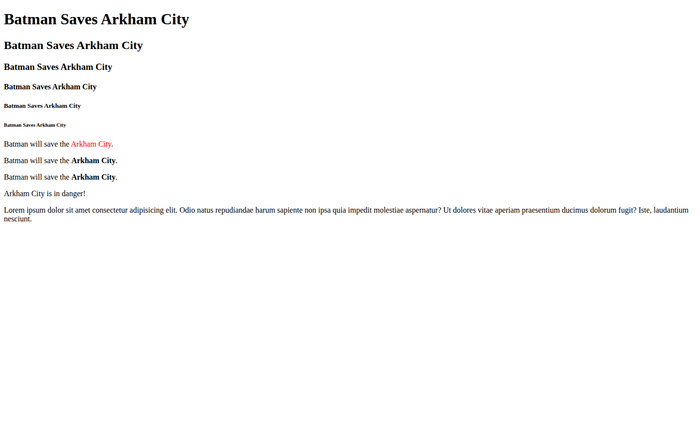

# Ultimate Web Development Bootcamp — Exercises

My exercises from the *Ultimate Web Development Pro Bootcamp: Zero to Hero* course, one folder per lesson.

| CSS Basics: colors | HTML: images |
| --- | --- |
|  |  |

## What's inside

- `HTML Basics/`: headings, paragraphs, text formatting, lists, and video
- `HTML/`: images
- `CSSBasics/`: selectors and colors

## Built with

- HTML
- CSS

## Run locally

No build step. Open any lesson's `index.html` in a browser.
